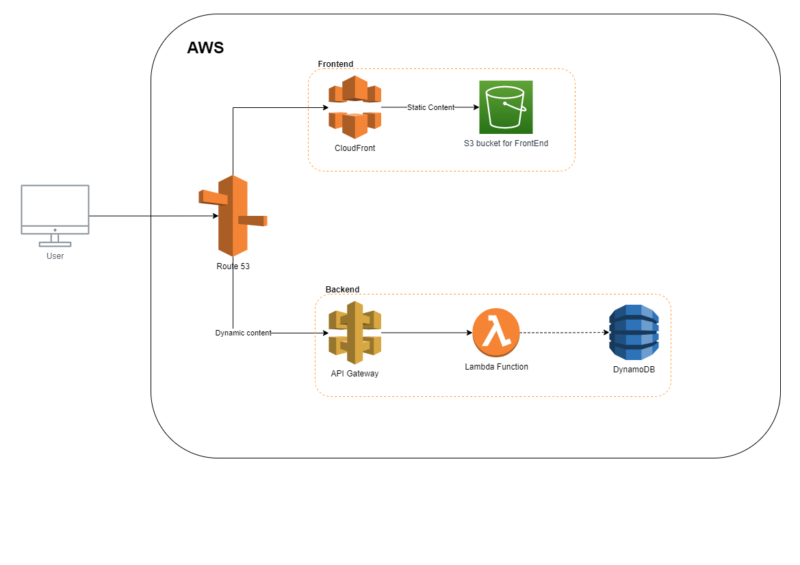

# Jajerverless - Terraform pour une infrastructure serverless dans AWS

## Sommaire

[Introduction](#introduction)

[Infrastructure](#infrastructure)

[Arborescence des fichiers](#arborescence-des-fichiers)

[API, Swagger, API Gateway et Lambda](#api-swagger-api-gateway-et-lambda)

- [Quel est le lien entre un Swagger et les services AWS ?](#quel-est-le-lien-entre-un-swagger-et-les-services-aws)
- [Sécurité de l'API](#sécurité-de-lapi)
- [Validation des requêtes soumises à l'API](#validation-des-requêtes-soumises-à-lapi)
- [Écriture d'un endpoint](#écriture-dun-endpoint)

[Modules Terraform](#modules-terraform)

- [API](#api)
  - [Exemple d'utilisation du module API](#exemple-dutilisation-du-module-api)
- [Base de données](#base-de-données)
  - [Exemple d'utilisation du module Base de données](#exemple-dutilisation-du-module-base-de-données)
- [Frontend](#frontend)
  - [Exemple d'utilisation du module Frontend](#exemple-dutilisation-du-module-frontend)
- [Hosted Zone](#hosted-zone)
  - [Exemple d'utilisation du module Hosted Zone](#exemple-dutilisation-du-module-hosted-zone)

[Déploiement](#déploiement)

- [Provider](#provider)
- [Buildspec](#buildspec)

## Introduction

Jajerverless est un projet d'application WEB entièrement serverless dans AWS. Les exemples donnés vous permettront un déploiement via terraform d'éléments comme :

- S3 bucket
- API Gateway (**basé sur un fichier swagger**)
- Lambda function
- ...

Le tout dans des fichiers terraform simplifiés et des astuces relatives au déploiement d'une API serverless.

Il est important de noter que l'ensemble des exemples mis ensemble ne font pas forcément de sens, il sera à vous de choisir quelles parties sont les plus adaptées à ce que vous voulez faire.

Et surtout, sentez-vous à l'aise d'utiliser, partager, modifier ce projet. Le but premier est avant tout un partage de connaissance que j'ai eu beaucoup de mal à trouver à un seul et même endroit. **De plus, ce projet sera mis à jour de temps en temps pour ajouter de nouveaux cas d'utilisations.**

Enjoy !

## Infrastructure


*Note : le schéma sera mis à jour en fonction de ce qui est disponible dans le terraform.*

Le but ici est donc d'avoir un terraform qui est capable de déployer :

- un ou plusieurs domaines.
- un ou plusieurs bucket S3 (pour la partie frontend) lié à un ou plusieurs domaines.
- une ou plusieurs API Gateway lié à un ou plusieurs domaines en fonction d'une documentation swagger.
- une ou plusieurs fonctions Lambda en fonction d'un ou plusieurs endpoint de l'API Gateway.
- une ou plusieurs bases de données DynamoDB.

Cette infrastructure disposera d'un frontend capable d'interagir avec une API qui elle-même pourra aller chercher ou écrire des informations dans une base de données.

## Arborescence des fichiers

L'arborescence de l'infrastructure sera composée comme suit :

    .
    ├── api ===================================> Voir partie API, Swagger, API Gateway et Lambda
    │   ├── api1
    │   │   ├── swagger.yaml
    │   │   ├── functionLambda1
    │   │   │   ├── file1.py
    │   │   │   ├── file2.py    
    │   │   │   └── ...
    │   │   └── functionLambda2
    │   │       ├── file1.py
    │   │       ├── file2.py
    │   │       └── ...
    |   ├── api2
    │   │   ├── swagger.yaml
    |   |   ├── functionLambda1
    │   │   │   ├── file1.py
    │   │   │   ├── file2.py    
    │   │   │   └── ...
    │   │   └── functionLambda2
    │   │       ├── file1.py
    │   │       ├── file2.py
    │   │       └── ...
    │   └── ...
    ├── modules
    |   ├── api ==========================> Voir partie Modules / API
    |   │   ├── acm.tf
    |   │   ├── lambda.tf
    │   │   ├── route53.tf
    │   │   └── variables.tf
    │   ├── database =====================> Voir partie Modules / Database
    │   │   ├── dynamodb.tf
    │   │   └── variables.tf
    │   ├── frontend =====================> Voir partie Modules / Frontend
    │   │   ├── acm.tf
    │   │   ├── cloudfront.tf
    │   │   ├── route53.tf
    │   │   ├── s3.tf
    │   │   └── variables.tf
    │   └── hosted_zone ==================> Voir partie Modules / Hosted Zone
    │       ├── route53.tf
    │       └── variables.tf
    ├── api.tf ================================> Voir partie Modules / API
    ├── databases.tf ==========================> Voir partie Modules / Database
    ├── frontend.tf ===========================> Voir partie Modules / Frontend
    ├── hosted_zone.tf ========================> Voir partie Modules / Hosted Zone
    ├── provider.tf ===========================> Voir partie Provider
    ├── terraform.tfvars
    └── buildspec.yaml ========================> Voir partie Buildspec

L'ensemble de cette arborescence sera bien évidemment détaillé.

## API, Swagger, API Gateway et Lambda

### Quel est le lien entre un swagger et les services AWS

Un fichier swagger est un fichier défini dans un format connu. Il a pour principal but de documenter une API. Bien souvent, ce fichier est utilisé comme base dans certains systèmes automatisés pour justement peupler une infrastructure. En effet, le fichier swagger contient les informations nécessaires pour comprendre une API comme par exemple :

- Le nom du chemin
- La méthode
- Le / les paramètre(s)
- La réponse
- ...

Il semble donc normal de vouloir partir de ce fichier pour le "traduire" en infrastructure AWS. La question est : quels sont les objets AWS nécessaires ? En regardant le schéma, il est possible de remarquer deux éléments importants pour l'API : l'API Gateway et les fonctions lambda. La question suivante sera probablement : qui fait quoi ? On pourrait simplement résumer en disant que :

- L'API Gateway va permettre un mapping entre les chemins (```/home```, ```/users```...), les verbes (```POST```, ```GET```...), les méthodes d'authenfication (api key par exemple) et les fonctions lambda.
- Les fonctions Lambda vont quant à elles réaliser le traitement.

Il y a bien sûr d'autres subtilités, mais ce résumé reste suffisant pour comprendre la suite.

À présent, la rédaction du fichier swagger peut commencer avec ces quelques lignes :

```yaml
openapi: 3.0.0

info:
version: '1.0'
title: "JAJ API"
description: "Example JAJ API"
servers:
- url: 'https://api.jaj.fr'
```

### Sécurité de l'API

En poursuivant l'écriture du swagger, il sera possible de définir l'authentification relative à l'API :

```yaml
components:
  securitySchemes:
  ApiKeyAuth:
    type: apiKey
    in: header
    name: x-api-key
```

Tout d'abord ```securitySchemes``` va permettre la déclaration de la sécurité pour l'ensemble des endpoints de l'API. Dans l'exemple actuel, les endpoints sont sécurisés avec une clé d'API (à l'avenir, d'autres solutions seront présentées). La section de sécurité peut alors être lue comme suit :

- ```type: apiKey``` = l'API Gateway va utiliser une api key pour sécuriser les endpoints (cette notion est connue d'API Gateway).
- ```in: header``` = l'api key à vérifier se trouvera dans le header de la requête.
- ```name: x-api-key``` = le nom du header sera ici ```x-api-key```.

### Validation des requêtes soumises à l'API

Toujours dans le bloc qui précède la déclaration des endpoints, il est possible de définir la responsabilité qu'aura l'API Gateway dans la validation des requêtes :

```yaml
x-amazon-apigateway-request-validators:
  all:
    validateRequestBody: true
    validateRequestParameters: true
x-amazon-apigateway-request-validator: all
```

Grâce au validator, l'API Gateway va vérifier plusieurs choses. Par exemple ici le validator déclaré est composé de deux paramètres :

- ```validateRequestBody: true``` = l'API Gateway va vérifier si les paramètres contenus dans le body sont bien présent et possède le bon type en fonction des informations contenues dans le swagger.
- ```validateRequestBody: true``` = ici il en sera de même pour les paramètres.

Par la suite, le validator sera attaché à l'ensemble des endpoints présents dans le swagger : ```x-amazon-apigateway-request-validator: all``` ("all" étant le nom du validator).

### Écriture d'un endpoint

Enfin, l'écriture des endpoints peut commencer (sous le bloc ```path``` dans le swagger). Voici un exemple d'endpoint pour la création d'un utilisateur :

```yaml
"/user/creation":
    options:
        summary: CORS support
        description: |
            Enable CORS by returning correct headers
        tags: ["User"]
        responses:
            200:
            description: Default response for CORS method
            headers:
                Access-Control-Allow-Origin:
                schema:
                    type: string
                Access-Control-Allow-Methods:
                schema:
                    type: string
                Access-Control-Allow-Headers:
                schema:
                    type: string
            content: {}
        x-amazon-apigateway-integration:
            type: mock
            requestTemplates:
            application/json: |
                {
                "statusCode" : 200
                }
            responses:
            default:
                statusCode: "200"
                responseParameters:
                method.response.header.Access-Control-Allow-Headers: '''Content-Type,X-Amz-Date,Authorization,X-Api-Key'''
                method.response.header.Access-Control-Allow-Methods: '''*'''
                method.response.header.Access-Control-Allow-Origin: '''*'''
                responseTemplates:
                application/json: |
                    {}
    post:
        tags: ["User"]
        description: "Create user."
        requestBody:
            required: true
            content:
            application/json:
                schema:
                type: object
                properties:
                    username:
                        type: string
                        example: Jaj User
                    password:
                        type: string
                        example: jajpassword!
                required:
                    - username
                    - password
                additionalProperties: false 
        responses:
            '200':
                description: "Réponse par défaut."
                content:
                    application/json:
                    schema:
                        type: object
                        properties:
                        error:
                            type: string
                            example: Réponse par défaut.
            '201':
                description: "Enregistrement réussi."
                content:
                    application/json:
                    schema:
                        type: object
                        properties:
                        error:
                            type: string
                            example: Enregistrement réussi.
            '400':
                description: "Mauvais paramètres"
                content:
                    application/json:
                    schema:
                        type: object
                        properties:
                        error:
                            type: string
                            example: Mauvais paramètres.
            '403':
                description: "Problème de droit."
                content:
                    application/json:
                    schema:
                        type: object
                        properties:
                        error:
                            type: string
                            example: Problème de droit.
        x-amazon-apigateway-integration:
            uri: "${uri_start}functionLambda1${uri_end}"
            httpMethod: "POST"
            type: "aws_proxy"
        x-amazon-apigateway-api-key-source: HEADER
        security:
            - ApiKeyAuth: []
```

Globalement l'écriture d'un endpoint reste assez classique. On remarquera surtout la présence d'une section ```OPTIONS```, qui est nécessaire pour la gestion des ```CORS``` (les paramètres ici peuvent être améliorés, voir notamment la documentation [de Mozilla](https://developer.mozilla.org/en-US/docs/Web/HTTP/CORS)). Mais surtout, on pourra noter la présence de plusieurs sections relatives à AWS :

- ```x-amazon-apigateway-integration``` = va permettre l'intégration de la fonction Lambda qui sera appelée lorsque le endpoint sera interrogé.
- ```uri``` = ici doit se trouver l'ARN (Amazon Resource Names) de l'invocation de la fonction Lambda. Toujours dans l'optique de simplifier, deux variables ont été insérées à savoir ```${uri_start}``` et ```${uri_end}```. Ces variables seront complétées par le Terraform directement. Il est seulement nécessaire de mettre le nom de la fonction lambda comme dans l'exemple ci-dessus.
- ```httpMethod``` = la méthode associée à l'intégration voulue. Par exemple ici la fonction ```functionLambda1``` sera appelée avec une méthode ```POST```.
- ```type``` = le type d'intégration permet notamment de savoir comment l'API Gateway va traiter la requête. Ici, l'une des meilleures solutions est d'utiliser ```aws_proxy```. En effet, cela permettra de transférer directement la requête au backend (ici la fonction Lambda).
- ```x-amazon-apigateway-api-key-source``` = permet d'indiquer l'endroit où l'API key sera renseignée (ici dans le header de la requête).
- ```security``` = permet de mettre en place les mécanismes de sécurité pour le endpoint. Dans cet exemple, il a été déclaré dans la partie précédente un composant ```ApiKeyAuth``` qui va être utilisé comme suit :
  - ```ApiKeyAuth: []``` = ```ApiKeyAuth``` peut être remplacé par le nom du composant de sécurité déclaré.

Ainsi, chaque endpoint de l'API peut-être lié a une fonction Lambda via une API Gateway.

## Modules Terraform

*Note : Dans une prochaine mise à jour, l'ensemble des fichiers de chaque module seront expliqués. En attendant, voici un exemple d'utilisation de chaque module.*

**Note importante : Il est nécessaire de déclarer un bloc concernant le module Hosted Zone. En effet, les autres modules dépendent d'une hosted zone AWS pour enregistrer les différents domaines voulus.**

### Hosted Zone

#### Exemple d'utilisation du module Hosted Zone

L'exemple présenté ici compose le fichier ```hosted_zone.tf``` présent dans l'arborescence de fichier. Ce module est probablement le plus important du projet. En effet, il permet de poser la ou les bases pour définir les noms de domaines des frontends et API. Certains autres modules dépendent de l'output de ce module, si celui-ci n’est pas créé, les autres modules ne seront pas fonctionnels.

Voici un exemple d'utilisation :

```javascript
module "hosted_zone_principal" {
    source  = "./modules/hosted_zone"
    domain_name = "jaj.fr"
}
```

L'ensemble de ces paramètres sont renseignés dans le fichier de variables du module. Elles peuvent être définies comme suit :

| Nom Variable     | Type   | Description                                                                                        |
|------------------|--------|----------------------------------------------------------------------------------------------------|
| source           | String | Le chemin vers le module ```hosted_zone```. Celui-ci devrait rester inchangé.                      |
| domain_name      | String | Le domaine de base pour la hosted zone (souvent utilisé comme domaine principal pour le frontend). |

### API

#### Exemple d'utilisation du module API

L'exemple présenté ici compose le fichier ```api.tf``` présent dans l'arborescence de fichier. Ce fichier permettra la création des éléments qui composent l'API à savoir :

- Un nom de domaine dans route53
- Un certificat
- Une API Gateway
- Des fonctions lambda
- Des autorisations pour des bases de données DynamoDB

Pour pouvoir déclarer une nouvelle API, il sera nécessaire de posséder un swagger ainsi que des fichiers qui composent les fonctions Lambda. Comme indiqué dans l'arborescence de fichier, les dossiers se trouvant dans le dossier ```api``` seront utilisés dans ce module.

Voici un bloc permettant la déclaration d'une API :

```javascript
module "my_api" {
    source  = "./modules/api"
    name_api = "MyAPI"
    path_base = "./api/api1/"
    domain_name_api = "myapi.jaj.fr"
    zone_id = module.hosted_zone_principal.zone_id_output
    endpoints_name = {
        "functionLambda1" = {
            permissions_databases = [{
                databases = ["MyDatabase"],
                permissions = [
                    "BatchGetItem",
                    "GetItem",
                    "Query",
                    "Scan",
                    "BatchWriteItem",
                    "PutItem",
                    "UpdateItem"
                ] 
            }]
        },
        "functionLambda2" = {
            permissions_databases = [{
                databases = ["MyDatabase2"],
                permissions = [
                    "BatchGetItem",
                    "GetItem",
                    "Query",
                    "Scan",
                ] 
            }]
        }
    }
}
```

L'ensemble de ces paramètres sont renseignés dans le fichier de variables du module. Elles peuvent être définies comme suit :

| Nom Variable     | Type       | Description                                                                    |
|------------------|------------|--------------------------------------------------------------------------------|
| source           | String     | Le chemin vers le module de ```api```. Celui-ci devrait rester inchangé.       |
| name_api         | String     | Le nom de l'API tel qu'il sera inscrit dans AWS.                               |
| path_base        | String     | Le chemin vers lequel l'ensemble du code des endpoints est stocké.             |
| domain_name_api  | String     | Le domaine qui permettra d'interroger l'API                                    |
| zone_id          | String     | La zone_id est issue du module précédent. Il devra être adapté en conséquence. |
| endpoints_name   | Object     | La liste des objets qui définiront les permissions et codes sources.           |

Pour la variable ```endpoints_name```, il est important de comprendre sa structure. Si on isole cette déclaration, un endpoint peut-être déclaré comme suit :

```javascript
"functionLambda2" = {
    permissions_databases = [{
        databases = ["MyDatabase2"],
        permissions = [
            "BatchGetItem",
            "GetItem",
            "Query",
            "Scan",
        ] 
    }]
}
```

Pour le paramètre ```functionLambda2```, celui-ci doit correspondre au nom de dossier du endpoint présent dans le dossier défini par la variable ```path_base``` (Voir la partie sur l'arborescence de fichier). Pour ```permissions_databases``` on pourra définir les paramètres comme suit :

| Nom Variable          | Type        | Description                                                                    |
|-----------------------|-------------|--------------------------------------------------------------------------------|
| permissions_databases | Object List | Liste d'objet qui associe une ou plusieurs bases de données à des permissions. |
| databases             | String List | Liste des bases de données concernées.                                         |
| permissions           | String List | Permissions associées aux bases de donnés concernées.                          |

*Note : pour plus d'information sur les permissions DynamoDB, voir [la documentation AWS](https://docs.aws.amazon.com/service-authorization/latest/reference/list_amazondynamodb.html).*

### Base de données

#### Exemple d'utilisation du module base de données

L'exemple présenté ici compose le fichier ```databases.tf``` présent dans l'arborescence de fichier. L'idée ici est de créer les bases de données DynamoDB. Les bases de données DynamoDB sont noSQL. Elles se composent d'une partition key (obligatoire), d'une sort key (optionnelle) et d'attributs (d'autres éléments peuvent composer une base de données DynamoDB mais ne sont pas encore mis en place dans ce projet). Contrairement aux bases de données plus "classique", il n'y a pas de relation entre les données autre qu'avec les clés mentionnées plus tôt. Il faut bien comprendre le besoin relatif à la base de données avant d'écrire le modèle.

Par exemple, si l'on voulait créer une base de données DynamoDB pour stocker des liens de réseau social, on pourrait alors déterminer que la partion key serait le nom du réseau social et son attribut le lien en question.

Un autre exemple, si l'on voulait trier des produits dans un magasin, on pourrait alors définir la partition comme étant le type de produit, la sort key comme étant le prix (elle permettra ainsi de trier les produits par prix) et en attribut une photo, une description, etc.

Voici un bloc permettant la déclaration d'une base de données :un attribut

```javascript
module "content" {
  source  = "./modules/database"
  database_name = "MyDatabase"
  primary_key = "Content_type"
  range_key = "Date_publish"
  attributes = [
    {
        name: "Content_type",
        type: "S"
    },
    {
        name: "Date_publish",
        type: "S"
    }
  ]
}
```

L'ensemble de ces paramètres sont renseignés dans le fichier de variables du module. Elles peuvent être définies comme suit :

| Nom Variable     | Type       | Description                                                                                          |
|------------------|------------|------------------------------------------------------------------------------------------------------|
| source           | String     | Le chemin vers le module de ```database```. Celui-ci devrait rester inchangé.                        |
| database_name    | String     | Le nom de la base de données.                                                                        |
| primary_key      | String     | Le nom de la partition key (obligatoire).                                                            |
| range_key        | String     | Le nom de la sort key (optionnel)                                                                    |
| attributes       | List Object| Les noms des attributs toujours composés au moins de la partition key et de la sort key (voir après).|

Pour le paramètre ```attributes``` est une liste d'objet qui vont permettre de définir l'ensemble des attributs qui compose de modèle. Il est nécessaire de mettre la partition key et la sort key (si spécifiée). L'avantage du noSQL c'est qu'il n'est pas nécessaire de connaitre à l'avance les attributs additionnels. Il sera tout simplement possible de les insérer dans la base plus tard en spécifiant un type de donnée.

Le paramètre ```attributes``` pourra alors comprendre des objets déclarés comme suit :

| Nom Variable     | Type       | Description                                                              |
|------------------|------------|--------------------------------------------------------------------------|
| name  | String   | Nom de l'atribut (doit correspondre aux clés).                                        |
| type  | String   | Type de la donnée : ```S``` pour String, ```N``` pour nombre et ```B``` pour binaire. |

### Frontend

#### Exemple d'utilisation du module Frontend

L'exemple présenté ici compose le fichier ```frontend.tf``` présent dans l'arborescence de fichier. Cette section va permettre la création des éléments suivants :

- Un bucket S3 pour le stockage des fichiers statique du frontend
- Un domaine dans route53 qui redirige vers le contenu du bucket
- Un certificat pour le HTTPS

Voici un bloc permettant la déclaration d'une base de données :

```javascript
module "jaj_frontend" {
    source  = "./modules/frontend"
    domain_name = "jaj.fr"
    zone_id = module.hosted_zone_principal.zone_id_output
    common_tags = {Terraform: "JAJ FrontEnd"}
}
```

L'ensemble de ces paramètres sont renseignés dans le fichier de variables du module. Elles peuvent être définies comme suit :

| Nom Variable     | Type       | Description                                                                    |
|------------------|------------|--------------------------------------------------------------------------------|
| source           | String     | Le chemin vers le module de ```frontend```. Celui-ci devrait rester inchangé.  |
| domain_name      | String     | Le nom du domaine qui permettra d'être dirigé vers le contenu du bucket S3.    |
| zone_id          | String     | La zone_id est issue du module précédent. Il devra être adapté en conséquence. |
| common_tags      | Object     | Les tags qui vont composer les éléments du front end.                          |

*Note : Le paramètre ```common_tags``` sera standardisé et utilisé dans les autres modules dans une prochaine mise à jour.*

## Déploiement

### Provider

Comme vu dans la partie sur l'arborescence de fichier, il est possible de voir un fichier nommé ```provider.tf```. Ce fichier va simplement permettre au Terraform de comprendre avec quel provider cloud il doit interagir. De plus, il est possible de lui spécifier un bucket S3 dans lequel l'état du déploiement du Terraform sera stocké (celui doit être créé directement dans AWS pour être utilisé).

Voici un bloc permettant la déclaration du provider :

```javascript
terraform {
    required_providers {
        aws = {
            source = "hashicorp/aws"
            version = "~> 4.22.0"
        }
    }
    backend "s3" {
        encrypt = true
        bucket  = "terraform-jaj-infra"
        key     = "jaj-infra-sse-s3"
        region  = "eu-west-3"
    }
}
```

Le paramètre ```region``` pourra être changé en fonction du contexte de déploiement.

### Buildspec

Le fichier ```buildspec.yaml``` va permettre notamment le déploiement dans le cadre d'un CodePipeline dans AWS. Celui-ci va décrire les opérations à effectuer dans le déroulement du CodePipeline. Le fichier ainsi fourni peut parfaitement se loger dans un CodePipeline en 4 étapes à savoir :

- Source = Qui se trigger lors d'un push dans un CodeCommit par exemple.
- Plan = Qui sera un CodeBuild avec une variable d'environnement "STEP" égal à "plan" pour permettre seulement le Terraform plan.
- Approve = Qui nécessitera une validation manuelle par un utilisateur.
- Apply = Très similaire à l'étape plan mais avec la variable d'environnement "STEP" égal à "apply" pour permettre le Terraform apply.

Voici à quoi pourrait ressembler ce fichier :

```yaml
version: 0.2

phases:
  install:
    commands:
      - "wget https://releases.hashicorp.com/terraform/1.2.5/terraform_1.2.5_linux_amd64.zip"
      - "unzip terraform_1.2.5_linux_amd64.zip"
      - "mv terraform /usr/local/bin/"
  pre_build:
    commands:
      - terraform init
  build:
    commands:
      - |
          if [ "$STEP" = "plan" ]; then
            terraform plan
          elif [ "$STEP" = "apply" ]; then
            terraform apply --auto-approve
          fi
```

Il est possible de remarquer 3 grandes étapes :

- ```install``` = Pour le téléchargement du binaire de Terraform. La version pourra être adaptée en fonction du contexte et des mises à jour fourni par Terraform. Pour avoir la liste des versions, il est possible d'utiliser [ce lien](https://releases.hashicorp.com/terraform/).
- ```pre_build``` = Utilisée pour l'initialisation du terraform.
- ```build``` = Cette étape va permettre d'effectuer la commande ```terraform plan``` ou ```terraform apply``` en fonction de la variable d'environnement ```STEP```.

*Note: lors de l'étape ```pre_build```, il est possible, en fonction du git utilisé, de devoir effectuer une commande ```cd``` pour se placer dans le dossier où se trouve les fichiers terraform.*
